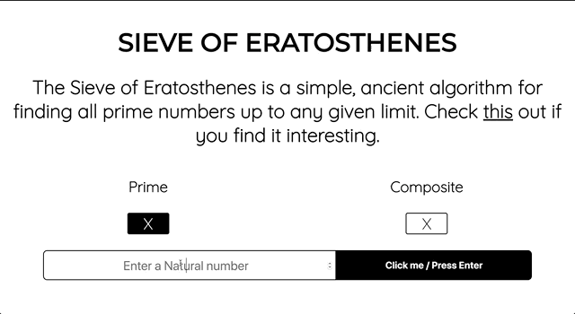

# SieveofEratosthenes
The Sieve of Eratosthenes is a simple, ancient algorithm for finding all prime numbers up to any given limit.

Here is a [Live Demo](https://harish.tech/projects/SieveOfEratosthenes/)

Made this using JavaScript.

Check [this](https://medium.com/i-math/prime-numbers-the-sieve-of-eratosthenes-ee22c119b6de) out if you want to see the magic behind the curtains.

This implementation was inspired by this gif

Feel free to use it if you find it interesting.

------
# May the force be with you
